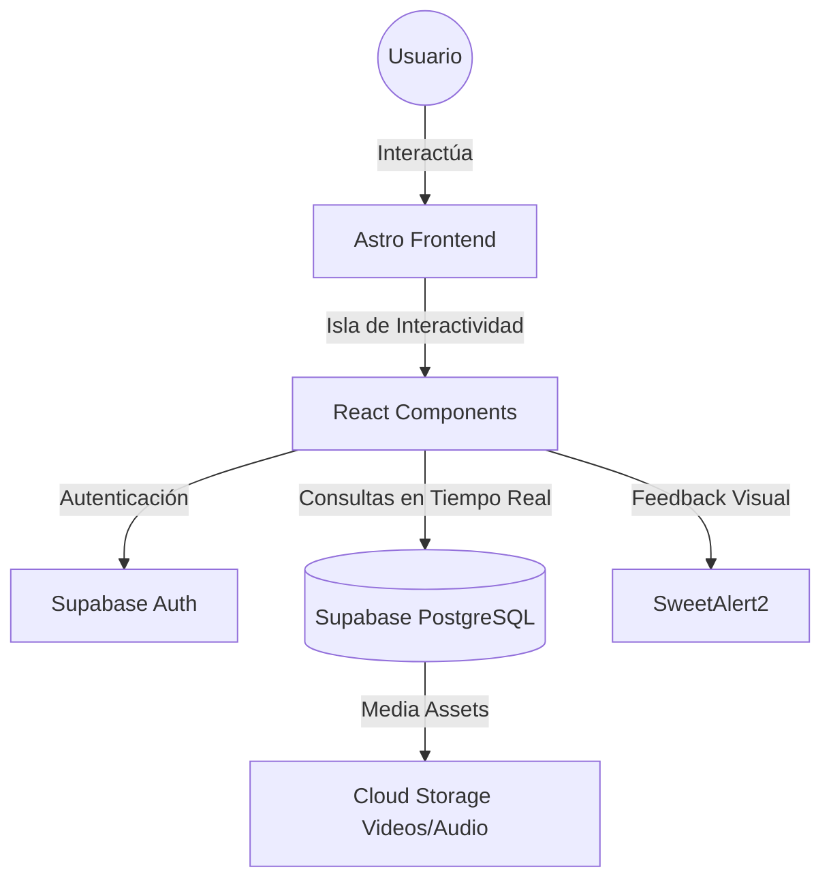

# 🧘‍♂️ MoodFit: Inteligencia Emocional Aplicada al Fitness

[](https://astro.build/)
[](https://reactjs.org/)
[](https://supabase.io/)
[](https://tailwindcss.com/)
[](https://www.typescriptlang.org/)

MoodFit es una plataforma web revolucionaria que rompe el esquema tradicional del entrenamiento físico. A través de un enfoque biopsicosocial, el sistema personaliza las rutinas de ejercicio basándose en el **estado de ánimo** actual del usuario, convirtiendo la actividad física en un mecanismo dinámico de regulación emocional.

---

## 🚀 Características Principales

*   **🧠 Algoritmo de Adaptación Emocional:** Selección inteligente entre 10 categorías emocionales para asignar la rutina perfecta (ej: *Yoga suave para la ansiedad* o *HIIT explosivo para la energía*).
*   **💎 Interfaz Premium:** Experiencia de usuario inmersiva con micro-animaciones, modo oscuro y diseño responsivo.
*   **🎥 Multimedia Center:** Guías en video de alta calidad sincronizadas con audio contextual para cada ejercicio.
*   **🔥 Calculadora de Intensidad MET:** Estimación precisa de quema calórica personalizada según el peso y el esfuerzo metabólico.
*   **🛡️ Checkout Seguro:** Formulario de pago inteligente con validación dinámica y múltiples métodos (Tarjeta, Yape, Plin).

---

## 🏗️ Arquitectura del Sistema

La aplicación utiliza una arquitectura moderna basada en **Jamstack** para garantizar velocidad, seguridad y escalabilidad.



### Stack Tecnológico
*   **Framework:** Astro (Arquitectura de Islas)
*   **UI Library:** React + Lucide Icons
*   **Estilos:** Tailwind CSS (Diseño utilitario premium)
*   **BaaS:** Supabase (PostgreSQL, Auth, RLS)
*   **Estado Global:** React Hooks (useEffect, useState)

---

## 📂 Estructura del Proyecto

```bash
MoodFit/
├── src/
│   ├── components/  # Componentes React (Checkout, AthleteProfile, etc.)
│   ├── layouts/     # Plantillas base de Astro
│   ├── pages/       # Rutas de la aplicación (.astro)
│   ├── lib/         # Configuraciones de Supabase y clientes
│   └── styles/      # Estilos globales y Tailwind
├── public/
│   ├── videos/      # Assets multimedia de alta calidad
│   └── musica/      # Audio contextual
└── .env             # Variables de entorno (Ignorado en Git)
```

---

## 🛠️ Configuración e Instalación

### Requisitos Previos
*   Node.js (v22 o superior recomendado)
*   Cuenta en Supabase

### Pasos para el Desarrollo Local

1. **Clonar el repositorio:**
   ```bash
   git clone https://github.com/Jhoinersenati/MoodFit.git
   cd MoodFit
   ```

2. **Instalar dependencias:**
   ```bash
   npm install
   ```

3. **Configurar variables de entorno:**
   Crea un archivo `.env` en la raíz con tus credenciales de Supabase:
   ```env
   PUBLIC_SUPABASE_URL=tu_url_de_supabase
   PUBLIC_SUPABASE_ANON_KEY=tu_clave_anon_de_supabase
   ```

4. **Ejecutar servidor de desarrollo:**
   ```bash
   npm run dev
   ```

---

## 🛡️ Seguridad y Datos

*   **Protección de Datos:** Las claves de API se manejan exclusivamente mediante variables de entorno ignoradas por Git.
*   **RLS (Row Level Security):** La base de datos en Supabase utiliza políticas de seguridad a nivel de fila para proteger la información de los usuarios contratados.
*   **Validación de Pago:** Los campos sensibles del checkout cuentan con máscaras de entrada para prevenir errores de captura.

---

## 👨‍💻 Créditos y Propósito

Este proyecto ha sido desarrollado como una **culminación académica de alto nivel**, demostrando la integración exitosa de tecnologías modernas con el bienestar humano integral.

> *"Optimización física a través del equilibrio emocional."* 